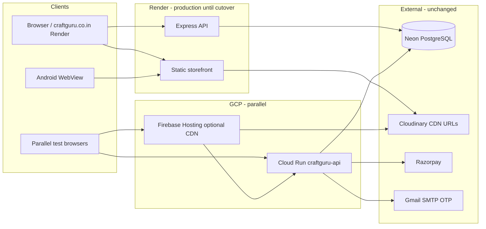

# GCP Migration Status — Craft Guru (parallel environment)

**Project:** `craft-guru-production`  
**Region:** `asia-south1`  
**Render production:** unchanged (no DNS cutover)  
**Last updated:** 2026-08-13

## Architecture overview



### Stack (unchanged application code)

| Layer | Technology |
|-------|------------|
| Frontend | Static HTML/CSS/JS at repo root |
| Backend | Node.js Express (`server/index.js`) |
| Database | Neon PostgreSQL (`DATABASE_URL`) |
| Images | Cloudinary URLs in DB (no server SDK) |
| Auth | Vendor portal, guest email OTP, Google Sign-In |
| Payments | Razorpay |

### GCP deployment model

1. **Cloud Run `craftguru-api`** — Docker image serves **API + static storefront** (same as Dockerfile copies full repo).
2. **Firebase Hosting** (optional) — CDN for static files; HTML patched with `PUBLIC_BILL_API_BASE` pointing to Cloud Run.

## Services created on GCP

| Resource | Status |
|----------|--------|
| APIs (Run, Build, Secret Manager, AR, Firebase) | ✅ Enabled |
| Artifact Registry `craftguru` (asia-south1) | ✅ Created |
| Cloud Build IAM (run.admin, secretAccessor, AR writer) | ✅ Granted |
| Secret Manager secrets | ⏳ **Pending** — copy from Render |
| Cloud Run `craftguru-api` | ⏳ Pending secrets + deploy |
| Firebase Hosting | ⏳ Pending first API deploy |

## Deployed URLs (after you complete secrets + deploy)

| Service | URL |
|---------|-----|
| Cloud Run API + static | `https://craftguru-api-<hash>-asia-south1.a.run.app` (stable after first deploy) |
| Firebase Hosting | `https://craft-guru-production.web.app` |
| Render (production) | Your current domain — **unchanged** |

## Cloud Run configuration

| Setting | Value |
|---------|-------|
| Service name | `craftguru-api` |
| Port | `8080` |
| CPU | 1 |
| Memory | 1Gi |
| Min instances | 0 |
| Max instances | 20 |
| Concurrency | 80 |
| Timeout | 300s |
| Health | `GET /health` (liveness + startup) |
| Readiness detail | `GET /api/health` (DB, Razorpay, email, etc.) |

## Docker image

| Item | Value |
|------|-------|
| Registry | `asia-south1-docker.pkg.dev/craft-guru-production/craftguru/craftguru-api` |
| Dockerfile | Repo root `Dockerfile` |
| Build | Cloud Build `cloudbuild.yaml` |

## Environment variables & secrets

See **`infra/gcp/RENDER-ENV-TO-GCP.md`** for Render → GCP mapping.

### Secret Manager → Cloud Run

| Secret name | Env var |
|-------------|---------|
| `craftguru-database-url` | `DATABASE_URL` |
| `craftguru-razorpay-key-id` | `RAZORPAY_KEY_ID` |
| `craftguru-razorpay-key-secret` | `RAZORPAY_KEY_SECRET` |
| `craftguru-google-client-id` | `GOOGLE_CLIENT_ID` |
| `craftguru-smtp-pass` | `GMAIL_APP_PASSWORD` |
| `craftguru-vendor-portal-password` | `VENDOR_PORTAL_PASSWORD` |

Optional (via `add-optional-secrets.sh`): WhatsApp, `BILL_API_SECRET`, `GUEST_OTP_PEPPER`.

### Cloud Run env vars (non-secret)

Set in `infra/gcp/env.cloudrun.yaml` or Console:

- `GMAIL_USER` — from Render
- `MAIL_FROM` — from Render
- `VENDOR_PORTAL_USER` — from Render
- `ALLOWED_ORIGIN` — production domains + Firebase URLs (+ Cloud Run URL via `post-deploy-update-origins.sh`)

## Cloudinary integration

| Check | Status |
|-------|--------|
| Server env vars required | **None** — URLs stored in Neon |
| Migrate to GCS | **No** |
| Implementation changes | **None** |
| Post-deploy verification | ⏳ After deploy: homepage banners, PDP gallery, vendor uploads |

## Commands to finish migration

```bash
cd /Users/devesh/Desktop/resin-boutique
export GCP_PROJECT_ID=craft-guru-production
export GCP_REGION=asia-south1

# 1. Export Render values (same names as Render dashboard)
export DATABASE_URL='...'
export GMAIL_APP_PASSWORD='...'
export GMAIL_USER='...'
export MAIL_FROM='Craftguru <...>'
export GOOGLE_CLIENT_ID='...'
export VENDOR_PORTAL_PASSWORD='...'
export VENDOR_PORTAL_USER='...'
export RAZORPAY_KEY_ID='...'
export RAZORPAY_KEY_SECRET='...'

# 2. Secrets + IAM
./infra/gcp/setup-secrets.sh

# 3. Deploy API (Cloud Build → AR → Cloud Run)
./infra/gcp/deploy-manual.sh

# 4. CORS for parallel testing on *.run.app
./infra/gcp/post-deploy-update-origins.sh

# 5. Optional secrets (WhatsApp, etc.)
./infra/gcp/add-optional-secrets.sh

# 6. Non-secret env on Cloud Run (if not in env.cloudrun.yaml)
gcloud run services update craftguru-api --region=asia-south1 \
  --update-env-vars="GMAIL_USER=$GMAIL_USER,MAIL_FROM=$MAIL_FROM,VENDOR_PORTAL_USER=$VENDOR_PORTAL_USER"

# 7. Firebase Hosting (optional CDN)
export PUBLIC_BILL_API_BASE=https://YOUR-CLOUD-RUN-URL.run.app
node tools/set-bill-api-base.js
firebase deploy --only hosting --project craft-guru-production
```

### Verify

```bash
RUN_URL=$(gcloud run services describe craftguru-api --region=asia-south1 --format='value(status.url)')
curl -fsS "$RUN_URL/health"
curl -fsS "$RUN_URL/api/health"
curl -fsS "$RUN_URL/api/catalog/categories" | head -c 500
```

## Estimated monthly cost (asia-south1, light retail traffic)

| Service | Estimate |
|---------|----------|
| Cloud Run (min 0, ~1Gi, sporadic traffic) | $5–25 |
| Artifact Registry | ~$1–5 |
| Cloud Build (few deploys/month) | ~$0–10 |
| Firebase Hosting (if used) | $0–5 |
| Secret Manager | &lt;$1 |
| Neon + Cloudinary + Render (until cutover) | Existing bills |

**Total GCP parallel env:** roughly **$10–40/month** depending on traffic. Render continues until you cut over.

## Files modified for GCP (Render untouched)

| File | Change |
|------|--------|
| `cloudbuild.yaml` | Full secret mapping, health probes |
| `infra/gcp/env.cloudrun.yaml` | Domains, cache, Gmail placeholders |
| `infra/gcp/setup-secrets.sh` | `GMAIL_APP_PASSWORD` support |
| `infra/gcp/bootstrap-project.sh` | **New** — APIs, AR, IAM |
| `infra/gcp/post-deploy-update-origins.sh` | **New** — CORS for parallel test |
| `infra/gcp/add-optional-secrets.sh` | **New** — WhatsApp / bill secret |
| `infra/gcp/RENDER-ENV-TO-GCP.md` | **New** — Render variable guide |
| `infra/gcp/DEPLOYMENT-STATUS.md` | **New** — this file |
| `.firebaserc` | Default project `craft-guru-production` |

**Not modified:** `render.yaml`, production DNS, storefront HTML API bases (still point to Render/local dev).

## Confirmations

- ✅ Render configuration **not removed**
- ✅ DNS **not changed**
- ✅ Neon PostgreSQL **unchanged**
- ✅ Cloudinary **unchanged** (no GCS migration)
- ⏳ Full feature parity on GCP — **after you run secrets + deploy**

## Manual steps remaining

1. Run `setup-secrets.sh` with Render credential values (blocked deploy until done).
2. Set `GMAIL_USER`, `MAIL_FROM`, `VENDOR_PORTAL_USER` on Cloud Run.
3. Run `deploy-manual.sh` and verification curls above.
4. Test parallel URLs (storefront, checkout, vendor, images).
5. When satisfied — **you** update DNS / domain mapping (not automated here).
